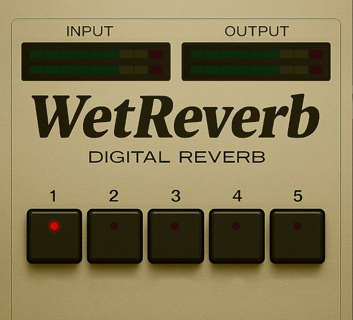

# WET Reverb VST3 Plugin


A professional reverb VST3 plugin with authentic 80s digital character, inspired by the Yamaha R1000, Electro-Harmonix Holy Grail, and Roland DEP-5.



## Quick Start

### Download

Download the latest release from the [Releases page](https://github.com/yonie/WetReverb/releases).

The download includes **all platforms** in one universal bundle:
- Windows (x64)
- Linux (x86_64)
- macOS (Apple Silicon)

### Installation

#### Windows
1. Download and extract `WetReverb-v1.0.0.zip`
2. Copy `WetReverb.vst3` to `C:\Program Files\Common Files\VST3\`
3. Restart your DAW and scan for plugins

#### Linux
1. Download and extract `WetReverb-v1.0.0.zip`
2. Copy `WetReverb.vst3` to `~/.vst3/` (create the folder if needed)
   ```bash
   mkdir -p ~/.vst3
   cp -r WetReverb.vst3 ~/.vst3/
   ```
3. Restart your DAW and scan for plugins

#### macOS
1. Download and extract `WetReverb-v1.0.0.zip`
2. Copy `WetReverb.vst3` to `~/Library/Audio/Plug-Ins/VST3/` (create the folder if needed)
3. Right-click `WetReverb.vst3` → Open → Click "Open" (one-time security bypass)
4. Restart your DAW and scan for plugins

**macOS Security Note:** The plugin is unsigned. On first load, macOS will show a security prompt. Click "Open" to allow it. This only needs to be done once.

## Usage

1. **Load the plugin** in your DAW (Reaper, Cubase, Ableton Live, FL Studio, etc.)
2. **Select reverb mode** using the 5 buttons: Room, Plate, Hall, Cathedral, Cosmos
3. **Monitor levels** using the input/output LED meters

### Reverb Modes

| Mode | Comb Filters | Pre-delay | Early Refl. | Character |
|------|--------------|-----------|--------------|-----------|
| Room | 4 | 17ms | 3-24ms (6 taps) | Intimate, prominent reflections |
| Plate | 8 | 0ms | 2-17ms (5 taps) | Dense shimmer |
| Hall | 10 | 25ms | 8-53ms (7 taps) | Spacious, smooth |
| Cathedral | 10 | 37ms | 12-79ms (8 taps) | Long, diffuse |
| Cosmos | 12 | 65ms | 15-92ms (6 taps) | Ethereal, infinite wash |

## Features

### 100% Wet Reverb
Pure reverb signal output - no dry signal in the mix. Perfect for:
- Parallel processing with dry signal in your DAW
- Creative sound design
- Authentic vintage rack reverb simulation

### 80s Rack-Style Character
- **24 kHz Internal Sample Rate** - Authentic vintage digital reverb with band-limited frequency response
- **12-bit Quantization** - Classic gritty digital character
- **TPDF Dither** - Smooth quantization
- **Stereo Crosstalk** - Authentic L/R channel bleed simulating analog circuitry
- **Early Reflections** - Program-dependent multitapped delay lines for realistic room ambience
- **HF Damping** - Mode-dependent high-frequency rolloff

### Schroeder-Style Algorithm
Parallel comb filters with damping followed by series allpass diffusion.

### VST3 Automation
Full parameter automation support in all major DAWs.

## System Requirements

| Platform | Requirements |
|----------|-------------|
| **Windows** | Windows 10/11 (64-bit) |
| **Linux** | x86_64 Linux |
| **macOS** | macOS 11.0+ (Apple Silicon) or macOS 10.13+ (Intel) |

**Supported DAWs:** Any DAW that supports VST3 plugins (Reaper, Cubase, Ableton Live, FL Studio, Studio One, Bitwig, etc.)

## Changelog

### v1.0.0 (2026-03-15)
- Initial release
- 5 reverb modes (Room, Plate, Hall, Cathedral, Cosmos)
- 80s digital character (24kHz, 12-bit)
- 9-segment LED meters
- Multi-platform support (Windows, Linux, macOS)

## Building from Source

For developers who want to build the plugin themselves.

### Prerequisites

#### Windows
- Visual Studio 2022 Build Tools or Community Edition
- CMake 3.15+
- Git

#### Linux (Ubuntu/Debian)
```bash
sudo apt-get install cmake gcc g++ libstdc++6 libx11-xcb-dev libxcb-util-dev \
    libxcb-cursor-dev libxcb-xkb-dev libxkbcommon-dev libxkbcommon-x11-dev \
    libfontconfig1-dev libcairo2-dev libgtkmm-3.0-dev libsqlite3-dev \
    libxcb-keysyms1-dev git
```

#### macOS
- Xcode Command Line Tools: `xcode-select --install`
- CMake 3.15+ (`brew install cmake`)

### Build Steps

1. **Clone with VST3 SDK:**
   ```bash
   git clone https://github.com/yonie/WetReverb.git
   cd WetReverb
   git clone --recursive https://github.com/steinbergmedia/vst3sdk.git
   ```

2. **Build:**
   - Windows: `build.bat`
   - Linux/macOS: `chmod +x build.sh && ./build.sh`

3. **Install:**
   - Windows: `install.bat`
   - Linux/macOS: `chmod +x install.sh && ./install.sh`

### Validation

The build process automatically runs the official VST3 validator (47 tests).

## Technical Details

| Property | Value |
|----------|-------|
| Framework | VST3 SDK (Steinberg) |
| Language | C++17 |
| GUI | VSTGUI4 |
| Supported Sample Rates | 22.05 kHz - 384 kHz |
| Internal Sample Rate | 24 kHz |
| Internal Bit Depth | 12-bit with TPDF dither |
| CPU Usage | <1% typical |
| Memory | ~300 KB |

### Audio Processing Chain

1. Anti-alias filter (10kHz LPF at host rate)
2. Downsample to 24kHz (linear interpolation)
3. Pre-delay (mode-dependent: 0-65ms)
4. Early reflections (multitapped delay line, program-dependent)
5. Parallel comb filters with internal damping (4-12 combs)
6. Series allpass filters for diffusion (4 allpasses)
7. Mix early reflections + late reverb
8. Output low-pass filter (6kHz)
9. High-pass filter (80Hz)
10. 12-bit quantization with TPDF dither and gain-stepping
11. Upsample to host rate
12. Reconstruction filter (10kHz LPF)

## Project Structure

```
WetReverb/
├── vst3sdk/                    # VST3 SDK (symlink or clone)
├── WetReverb/                  # Plugin source
│   ├── source/                 # C++ source files
│   ├── resource/               # GUI definition and assets
│   └── CMakeLists.txt          # Build configuration
├── .github/workflows/          # GitHub Actions CI/CD
├── scripts/                    # Build scripts
├── build.bat / build.sh        # Build scripts
├── install.bat / install.sh    # Installation scripts
└── README.md
```

## Troubleshooting

### Plugin Not Appearing in DAW
- Restart your DAW after installation
- Check the correct VST3 folder location
- Run a plugin rescan in your DAW settings

### macOS "Apple Could Not Verify" Warning
- Right-click the plugin → Open → Open (one-time)
- Or run: `xattr -cr ~/Library/Audio/Plug-Ins/VST3/WetReverb.vst3`

### No Sound Output
- Verify the plugin is receiving audio input (check meters)
- Make sure track routing goes through the plugin

## License

MIT License - Copyright © 2026 Ronald Klarenbeek

The VST3 SDK is licensed separately under a BSD-style license (see VST3 SDK license files).

## Author

**Ronald Klarenbeek**
- Website: [https://wetvst.com](https://wetvst.com)
- Email: contact@wetvst.com
- GitHub: [https://github.com/yonie](https://github.com/yonie)

---

**Built with precision engineering for authentic vintage reverb character**